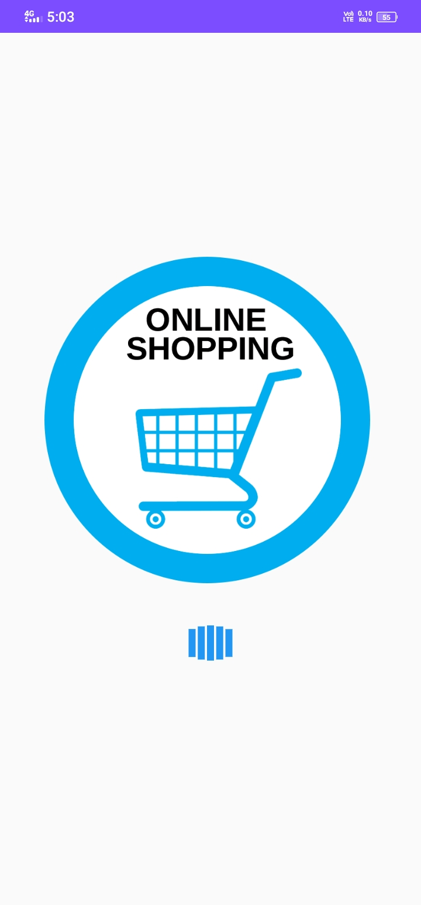

# Flutter Ecommerce App

This Flutter Ecommerce App is a mobile application designed for online shopping, featuring a splash screen and a beautiful user interface inspired by popular ecommerce apps.

## Features

- **Splash Screen:** Engaging splash screen to provide a visually appealing introduction to the app.

- **Beautiful UI:** Designed with a modern and user-friendly interface, ensuring a seamless shopping experience.

- **Product Listings:** Browse through a variety of products with detailed information and images.


## Screenshots



*Caption for Splash Screen*


*Caption for Product Listing*

## Getting Started

These instructions will help you set up and run the project on your local machine for development and testing purposes.

1. **Clone the repository:**

    ```bash
    git clone https://github.com/your-umarazizdev/Flutter-Ecommerce-App.git
    ```

2. **Navigate to the project folder:**

    ```bash
    cd flutter_ecommerce_app
    ```

3. **Install dependencies:**

    ```bash
    flutter pub get
    ```

4. **Run the app:**

    ```bash
    flutter run
    ```

## Dependencies

- [Flutter](https://flutter.dev/): Google’s UI toolkit for building natively compiled applications for mobile, web, and desktop from a single codebase.
- [Add other dependencies here...]

## Contributing

Feel free to contribute to this project by [opening issues](https://github.com/your-username/your-repo/issues) or creating pull requests. Your input is highly valued!

## License

This project is licensed under the MIT License - see the [LICENSE.md](LICENSE.md) file for details.

## Acknowledgments

- Hat tip to anyone whose code was used
- Inspiration
- etc.

